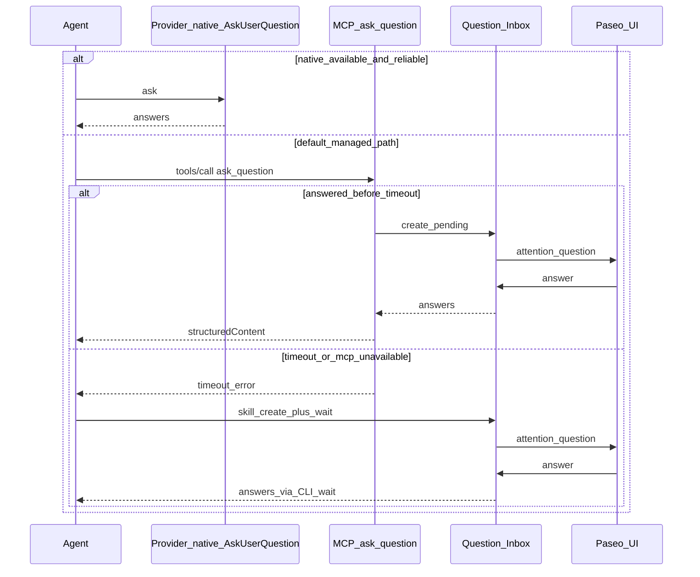

# Question Inbox

How Paseo-managed agents ask the user for decisions — MCP first, skill fallback on timeout — and how those questions become a durable inbox. Questions are answered from the agent timeline or via CLI; there is no global Approvals page.

## Goals

- Keep **`ask_question` MCP** as the primary path for managed agents (blocking tool call → Paseo UI → answers).
- When MCP **times out or is unavailable**, fall back to a **skill-driven inbox wait** so the decision is not lost to chat prose.
- Prefer **provider-native question UI** when the session already has one (e.g. Claude / Cursor `AskUserQuestion`) and it is reliable in that environment.
- Persist every inbox-bound question so it can be answered from the agent timeline or via CLI.

## Policy (priority order)

1. **Provider-native question tool** — If the provider exposes a built-in AskUserQuestion-class tool _and_ it works in this session, use it. Do not also open an inbox item unless we later mirror native answers (Phase 3).
2. **MCP `ask_question`** — Default for Paseo-managed agents. Blocks until the user answers in the Paseo app/web/desktop UI (or dismisses).
3. **Skill fallback (timeout / MCP failure)** — If MCP returns a timeout / transport error / “tool unavailable”, the agent follows the `paseo-ask` skill: create an inbox question and **wait** via CLI (or a thin wait tool) until answered.
4. **Never** ask for a decision in chat prose. Prose-stop continues to nudge agents back into this ladder.

MCP is **not** removed. Skill is not a parallel happy path — it is the recovery path when MCP cannot finish.

## Current code

| Piece                                                                                                           | Role                                                                                                                                                                 |
| --------------------------------------------------------------------------------------------------------------- | -------------------------------------------------------------------------------------------------------------------------------------------------------------------- |
| MCP `ask_question` in [`paseo-tools.ts`](../packages/server/src/server/agent/tools/paseo-tools.ts)              | Agent-scoped tool; calls `agentManager.askAgentQuestion`                                                                                                             |
| [`askAgentQuestion`](../packages/server/src/server/agent/agent-manager.ts)                                      | Creates inbox row (`source: mcp`) + pending permission `kind: "question"`; UI/CLI answer settles waiter                                                              |
| [`QuestionStore`](../packages/server/src/server/question/store.ts)                                              | Durable `$PASEO_HOME/questions/<id>.json`                                                                                                                            |
| WS RPCs `question.list` / `question.answer`                                                                     | CLI and future Approvals UI                                                                                                                                          |
| CLI `paseo question ls \| answer`                                                                               | Debug / scripting over the same inbox                                                                                                                                |
| Timeline disguise [`ask-question-timeline.ts`](../packages/server/src/server/agent/ask-question-timeline.ts)    | Project MCP calls as Claude `AskUserQuestion` for consistent cards                                                                                                   |
| UI [`ask-question-card.tsx`](../packages/app/src/components/ask-question-card.tsx)                              | Renders question + answers on the timeline                                                                                                                           |
| Wait socket [`wait-socket.ts`](../packages/server/src/server/question/wait-socket.ts)                           | Local NDJSON waiter at `$PASEO_HOME/question-wait.sock`                                                                                                              |
| Native mirror [`native-mirror.ts`](../packages/server/src/server/question/native-mirror.ts)                     | Audit-write settled native AskUserQuestion into inbox (`source: native_mirror`)                                                                                      |
| Prose-stop nudge [`nudge-prompt.ts`](../packages/server/src/server/agent/prose-stop/nudge-prompt.ts)            | Turn-end backstop: pushes agents away from prose and toward ask_question (skipped for orchestrated background agents — see [agent-lifecycle.md](agent-lifecycle.md)) |
| Prevention prompt [`prevention-prompt.ts`](../packages/server/src/server/agent/prose-stop/prevention-prompt.ts) | `proseStop.preventionPrompt` (default on): short `daemonAppendSystemPrompt` so agents avoid prose waits up front (same orchestrated skip)                            |

**P1–P3 landed:** durable inbox + MCP persistence + `question.list/answer/create/wait` + CLI + `paseo-ask` skill + wait socket + native_mirror audit. The global Approvals page was removed; the inbox remains available through agent cards and CLI.

## Target shape

### Question Inbox store

Persist under `$PASEO_HOME/questions/<id>.json` (Zod + atomic write; see [data-model.md](data-model.md)):

- `id`, `agentId`, `workspaceId?`, `createdAt`, `expiresAt?`
- `status`: `pending | answered | dismissed | expired`
- `title?`, `questions[]` — same shape as MCP `ask_question` input
- `answers?` — keyed by question `header`
- `source`: `mcp | skill | cli | native_mirror`
- `mcpRequestId?` — link back to the permission / tool call when created via MCP

MCP `ask_question` and skill/CLI create **the same records**. Answering from the agent card or CLI settles the same waiter.

### Channels

| Channel                                             | When                                                                                    |
| --------------------------------------------------- | --------------------------------------------------------------------------------------- |
| MCP `ask_question`                                  | Happy path; create inbox row + wait (same as today’s permission wait, plus persistence) |
| CLI `paseo question create \| wait \| answer \| ls` | Skill fallback and scripting; `wait` prefers `$PASEO_HOME/question-wait.sock` then WS   |
| WS RPCs `question.*`                                | App UI (agent card + Approvals); follow [rpc-namespacing.md](rpc-namespacing.md)        |
| Unix socket                                         | `$PASEO_HOME/question-wait.sock` — NDJSON `{"op":"wait",…}` (unix only; mode 0600)      |

### Skill (`paseo-ask`)

Managed skill text (not a second product surface):

1. Prefer native AskUserQuestion when available and reliable.
2. Otherwise call MCP `ask_question`.
3. On **timeout / unavailable / retriable transport failure**:  
   `paseo question create …` then `paseo question wait <id>` (or equivalent MCP wait helper).  
   Do not re-ask in prose; do not invent a second UI.
4. Treat dismiss as a real outcome (`dismissed=true`).

Timeout threshold should be explicit in the skill (and eventually configurable). Cursor-side MCP `tools/call` timeouts and daemon-side wait limits are separate clocks — document both when implementing.

## Phases

### P0 — Docs (this file)

Architecture and policy only.

### P1 — Inbox + MCP persistence ✅

- Question store under `$PASEO_HOME/questions` (Zod + atomic write).
- MCP `ask_question` writes `source: mcp` with `mcpRequestId`; answer/dismiss via agent card or `question.answer` settles the same waiter.
- CLI `paseo question ls/answer` over WS RPCs.

### P2 — Timeout → skill fallback ✅

- `paseo-ask` skill under `skills/paseo-ask` (desktop managed skill list).
- MCP `ask_question` returns `timedOut` + optional `questionId` on tools/call abort; permission/inbox stay pending for the same id.
- CLI + RPCs: `paseo question create/wait` (`question.create` / `question.wait`).
- Timeout classifier in `packages/server/src/server/question/timeout.ts`; prose-stop nudge teaches the ladder.
- User dismiss stays `dismissed=true` and must not trigger fallback.

### P3 — Inbox extras ✅

- Unix socket waiter at `$PASEO_HOME/question-wait.sock` (NDJSON wait; advertised as `features.questionWaitSocket` on non-Windows).
- Native AskUserQuestion settlements are mirrored into the inbox as `source: native_mirror` **after settle** (audit only — no second answerable UI).

### Lifecycle hygiene (anti-junk)

| Event                                        | Inbox status                                  | Approvals tab                      |
| -------------------------------------------- | --------------------------------------------- | ---------------------------------- |
| MCP / skill / CLI create (still waiting)     | `pending`                                     | Pending                            |
| MCP `tools/call` timeout                     | stays `pending`, sets `expiresAt` = now + 30m | Pending (skill may `wait` same id) |
| Skill/CLI `question.create`                  | `pending` + `expiresAt` = now + 30m           | Pending                            |
| Past `expiresAt` (swept on list/wait/answer) | `expired`                                     | Closed                             |
| Turn interrupt / turn fail (system abandon)  | `expired`                                     | Closed                             |
| User dismiss                                 | `dismissed`                                   | Closed                             |
| User answer                                  | `answered`                                    | Answered                           |

Interrupt resolves any still-blocking MCP waiter as **dismiss** (not `timedOut`) so skill timeout fallback does not fire. TTL expiry clears leftover permissions the same way.

Closed rows (`dismissed` / `expired`) record `closedAt` and are **hard-deleted** after **7 days** (swept on list/wait/answer). Answered rows are kept.

## Risks

- **Double UI**: Native AskUserQuestion and Paseo card must not both block the same decision. Policy: native wins when chosen; MCP/skill own the inbox path.
- **Timeout re-ask doubles**: MCP timeout keeps the first permission pending so skill can `wait` the same id. If the agent still opens a second `ask_question` / `question.create`, daemon **supersedes** prior inbox question permissions/rows for that agent (expire + drop the orphan form). App UI also keeps only the newest inbox question form as a client-side backstop. Plan-execute CTAs are not superseded.
- **False fallback**: User dismiss or slow answer must not look like MCP timeout. Classify errors before invoking the skill.
- **Two waiters**: MCP promise and CLI `wait` must share one inbox id / one resolve; never fork two pending rows for one decision.
- **Protocol**: Keep MCP tool schema backward-compatible; new RPCs are additive `question.*` pairs.

## Glossary terms

- **Question Inbox** — Durable store of user decisions requested by agents (`$PASEO_HOME/questions`).
- **ask_question** — Paseo MCP tool (primary path).
- **paseo-ask** — Skill that encodes native → MCP → timeout fallback.
