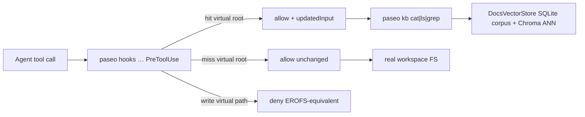
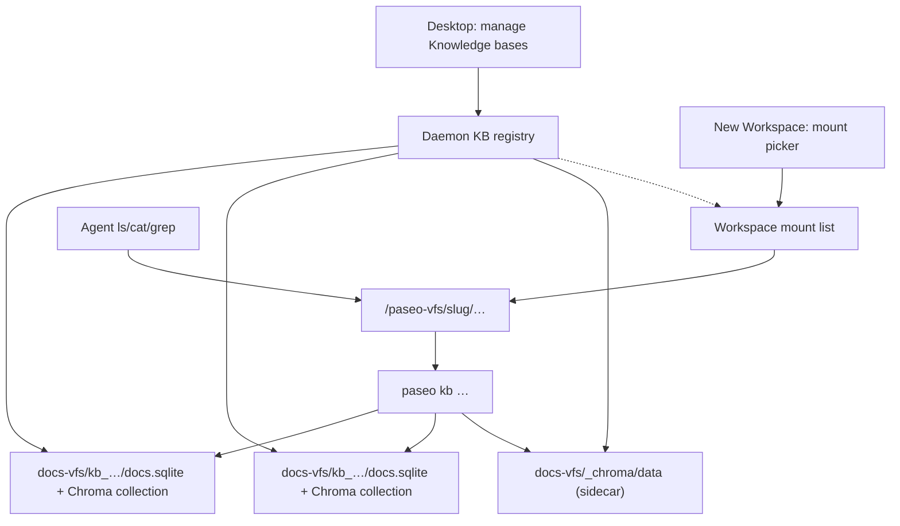

# Virtual docs via hooks (no FS layer)

Design for a Mintlify-ChromaFs-_shaped_ docs explorer: agents use `ls`/`cat`/`grep` against `/paseo-vfs/docs`, while the **content plane is a local vector database** (not ad-hoc filesystem reads). We still avoid implementing `just-bash` / `IFileSystem` — hooks only prefix-rewrite to `paseo kb …`.

Related: [terminal-activity.md](./terminal-activity.md), [providers.md](./providers.md), [question-inbox.md](./question-inbox.md).

## Content plane = vector DB (ChromaFs-aligned)

Mintlify stores chunks + `__path_tree__` in **Chroma** and translates UNIX ops into DB queries. Paseo keeps the same query shape with a **local-first split plane**:

| Mintlify (Chroma)                    | Paseo                                                                                             |
| ------------------------------------ | ------------------------------------------------------------------------------------------------- |
| Chroma collection                    | **Chroma** collection `docs_<storeKey>` (chunk embeddings + documents) via local sidecar          |
| `__path_tree__` in collection        | SQLite `path_tree` (slug → `{isPublic,groups}`)                                                   |
| Original page text                   | SQLite `pages` (export / `cat` prefer this; not chunk-join alone)                                 |
| `cat` = chunks by page slug          | `pages` row, else `chunks` by slug ordered by `chunk_index`                                       |
| `grep` = `$contains`/`$regex` + fine | SQL `LIKE` coarse → reassemble page → line regex                                                  |
| Vector search                        | Chroma ANN (`paseo kb search`) — **not** JS full-table cosine                                     |
| Embeddings service                   | Local OpenAI-compatible (`qwen3-embedding:0.6b`); vectors supplied to Chroma (no Chroma embedder) |

### Why a Chroma sidecar (not embedded JS)

**Conclusion (2026-08-01):** the official `chromadb` JS/TS client is **HTTP-only** — there is no `PersistentClient` / in-process embedded store (unlike Python). Embedding the Rust server inside Electron’s Node ABI is also a non-goal (NAPI platform packages + Electron).

**Chosen path:** pin `chromadb@3.5.0` on `@getpaseo/server` and **auto-spawn** the official CLI (`chroma run --path …`) as a loopback sidecar under `$PASEO_HOME`. Transparent to users — `paseo kb index|search` / import call `ensureDocsChromaSidecar`; no remote Chroma cluster required. Override with `PASEO_CHROMA_URL=http://127.0.0.1:<port>` when a process already owns the server (tests / advanced).

| Piece                        | Role                                                                                          |
| ---------------------------- | --------------------------------------------------------------------------------------------- |
| `chromadb` HTTP client       | Pure JS — safe in daemon / Electron-as-Node query path                                        |
| `chromadb` CLI + JS bindings | Spawns Rust frontend; loads `chromadb-js-bindings-<platform>` **only in the sidecar child**   |
| SQLite (`node:sqlite`)       | Corpus: `meta` / `path_tree` / `pages` / chunk **text** (empty embedding BLOB on new indexes) |

### Runtime: `node:sqlite` + Chroma sidecar

`paseo kb` still uses `node:sqlite` (`DatabaseSync`) for corpus. That module ships with Node 22.5+ (still experimental). Verified for this checkout:

| Runtime                                | How Paseo runs it                                                                          | Node               | `node:sqlite` | Chroma sidecar                                                  |
| -------------------------------------- | ------------------------------------------------------------------------------------------ | ------------------ | ------------- | --------------------------------------------------------------- |
| Host CLI (`npm run cli` / system Node) | plain `node`                                                                               | 24.13.0 (dev host) | OK            | OK (optionalDeps platform binding)                              |
| Desktop Electron **43.2.0**            | `ELECTRON_RUN_AS_NODE=1` on `Electron` / `Electron Helper` (daemon + packaged `bin/paseo`) | **24.18.0**        | **OK**        | Sidecar spawned with same `execPath` + `ELECTRON_RUN_AS_NODE=1` |

Desktop never needs a separate Node install for the daemon/CLI path: `createElectronNodeEnv` and `packages/desktop/bin/paseo` always set `ELECTRON_RUN_AS_NODE=1`. Do **not** probe with a bare GUI `electron -e …` launch — that opens the app and hangs; use `ELECTRON_RUN_AS_NODE=1 "$ELECTRON_BIN" -e '…'`.

### Local models (text only)

Daemon/CLI do **not** ship weights. **Docs VFS ingest is text-only** (`.md` / `.mdx` / `.txt`). No OCR / vision / video extractors in this feature.

| Role           | Candidate                  | Decision                             |
| -------------- | -------------------------- | ------------------------------------ |
| **Embeddings** | **`qwen3-embedding:0.6b`** | **Locked** (Ollama `/v1/embeddings`) |
| Embed fallback | `nomic-embed-text`         | If 0.6B too heavy                    |

```json
{
  "localTools": {
    "embeddings": {
      "enabled": true,
      "baseUrl": "http://127.0.0.1:11434/v1",
      "apiKey": "ollama",
      "model": "qwen3-embedding:0.6b"
    }
  }
}
```

Until a daemon build includes `localTools.embeddings` on `PersistedConfigSchema`, prefer env: `PASEO_EMBEDDINGS_ENABLED=1` / `PASEO_EMBEDDINGS_MODEL=…`. Do **not** write unknown keys into an older packaged daemon's `config.json`.

**Out of scope (2026-07-31):** HunyuanOCR, Nanbeige VLM, VideoChat3, `qwen2.5vl`, PDF/image/video ingest. Local Tools Scan/Image/Video (if any) is a **separate** product track — do not fold into `/paseo-vfs`.

### Runtime rule

After `paseo kb index`, **`ls` / `cat` / `grep` / `search` read the vector DB**, not the live `docs/` tree. Re-index when docs change. Ingest sources workspace `docs/` (or `--root`) **text files only**.

## Goal

- Coding agents can read a **virtual docs tree** (indexed or remote content) through familiar tools.
- Prefer **hook-based command/path rewrite** over a fake filesystem runtime.
- Keep the real workspace FS untouched for non-virtual paths.

## Non-goals

- No TypeScript bash / `IFileSystem` (Mintlify's ChromaFs shape).
- No sandbox replacement for general coding (agents still use the real cwd).
- No claim of full UNIX fidelity (`find | xargs | awk` pipelines over the virtual tree).
- Not a replacement for RAG everywhere — this is an **explore-by-path** surface.
- **No multimodal ingest** — no PDF/image/video OCR or VL extractors in docs VFS (text `.md`/`.mdx`/`.txt` only).

## Core insight

Agents need the _illusion_ of a filesystem, not a real one. In Paseo that illusion is:

```
tool call (Bash / Read / Grep / Glob)
  → PreToolUse router (rewrite or deny)
  → real tool runs rewritten args
  → `paseo kb …` queries DocsVectorStore (SQLite corpus + Chroma vectors)
```

`updatedInput` only swaps tool arguments. The hook is a **router**; the vector DB is the **disk**.

## Architecture



| Layer                   | Owns                                                          | Does not own                  |
| ----------------------- | ------------------------------------------------------------- | ----------------------------- |
| Hook router             | Match virtual root; rewrite/deny; stay fast                   | Indexing, embeddings, ACL     |
| `paseo kb` CLI          | Thin Commander wrapper over shared DocsVectorStore            | Provider tool-protocol quirks |
| DocsVectorStore         | Core under `packages/server/src/server/docs-vfs/` (CLI + MCP) | Bash illusion                 |
| Chroma sidecar          | Local ANN for chunk embeddings (`docs-vfs/_chroma/`)          | Page authoring / export text  |
| Skill / AGENTS guidance | Teach agents the virtual root exists                          | Enforcement (hooks enforce)   |

### Virtual root convention

Stable prefix agents see in prompts and hooks:

- Path form: **`/paseo-vfs/<kb-slug>/...`** (fixed POSIX-style root; Windows path mapping is an implementation detail later — do not use env-expanded `$PASEO_VFS` for matching).
- **`docs` is the default slug** for the dogfood KB that indexes a checkout's `docs/` tree — so today's `/paseo-vfs/docs/...` stays valid.
- `ls /paseo-vfs` lists **mounted** knowledge-base slugs for the current workspace (not every KB on the daemon).
- Primitives only: `ls`, `cat`/`Read`, `grep`/`Grep`, shallow `find`/`Glob`.
- Writes under the virtual root always deny (stateless, no cross-agent corruption).

## Knowledge bases + workspace mounts

One global `docs/` layer is not enough. Product model (locked 2026-07-31):

| Layer                                      | Owns                                                                                                                               | Does not own                        |
| ------------------------------------------ | ---------------------------------------------------------------------------------------------------------------------------------- | ----------------------------------- |
| **Knowledge base** (daemon-scoped)         | Identity, slug, **imported corpus** under `$PASEO_HOME/docs-vfs/<kbId>/`, embeddings rebuilt from corpus                           | Live filesystem sync; workspace ACL |
| **Knowledge base mount** (workspace-owned) | Ordered list of KB ids mounted into this workspace                                                                                 | Corpus bytes                        |
| **Desktop / host UI**                      | Import / export / edit corpus / delete KBs; browse registry — see [knowledge-bases-desktop.md](./knowledge-bases-desktop.md)       | Agent tool protocols                |
| **New Workspace**                          | Mount picker at create time (which KBs appear under `/paseo-vfs`) — see [knowledge-bases-desktop.md](./knowledge-bases-desktop.md) | Defining KB content                 |



### Why daemon KB + workspace mounts

- **Reuse across Projects** — a host-wide "company runbooks" KB can mount into many workspaces without copying trees.
- **Per-workspace lens** — two workspaces on the same Project can mount different sets (feature work vs ops).
- **Matches create UX** — Isolation / branch choices already happen at workspace create; mounts are the same class of create-time preference, persisted as workspace-owned state.

Project does **not** own the KB catalog. A Project may later offer _suggested_ mounts (e.g. auto-detect `docs/`), but the registry stays daemon-scoped and the authoritative mount list stays on the Workspace.

### Locked semantics (2026-07-31 → 2026-08-01)

| Topic                      | Lock                                                                                                                                                                                                         |
| -------------------------- | ------------------------------------------------------------------------------------------------------------------------------------------------------------------------------------------------------------ |
| **Enforcement**            | **Daemon-side.** When `PASEO_WORKSPACE_ID` is set, `paseo kb` only opens **mounted** KBs. `--root` (hash dogfood) and unmounted `--kb` require explicit `--unsafe`. Hooks rewrite only; they do not own ACL. |
| **Lifecycle**              | **Import once → self-contained.** After import, the KB is the source of truth. **No re-sync from disk.** Updates = edit imported corpus in-place, or create a new KB.                                        |
| **Import**                 | One-shot ingest of text files (`.md` / `.mdx` / `.txt`) into the KB store (path_tree + page text + embeddings). Disk paths are **import inputs only**, not durable links.                                    |
| **Export**                 | **Corpus package**: path_tree + original page text + KB metadata. Embeddings are **not** required in the package — rebuild on import/open with the daemon's embedding model.                                 |
| **Not a live mirror**      | Repo `docs/` / branch / worktree freshness is **out of scope** for registered KBs. Checkout-local explore stays on `paseo kb --root` dogfood.                                                                |
| **New Workspace defaults** | **Empty mounts** — user must opt in. No auto-detect `<cwd>/docs`. Form preference for last selection is a later Desktop concern.                                                                             |
| **Slug**                   | Daemon KB slug: `^[a-z0-9][a-z0-9-]{0,62}$`, unique on the daemon. Mount slug: defaults to KB slug, **workspace-unique**, set at mount time, **immutable** (change = unmount + remount).                     |
| **Delete**                 | Refuse delete while any workspace still mounts the KB (no silent cascade).                                                                                                                                   |
| **Embeddings**             | Inherit daemon `localTools.embeddings`; rebuild from corpus when model changes. Per-KB override reserved, not implemented.                                                                                   |

### Import / export (product end state)

```text
disk or corpus package  ──import once──►  KB store (path_tree + text + vectors)
                                              │
                         maintain in Desktop / future edit APIs only
                                              │
                                        ◄──export──  corpus package (text + meta)
```

| Op                      | Behavior                                                                                                                                  |
| ----------------------- | ----------------------------------------------------------------------------------------------------------------------------------------- |
| **Import**              | Create KB + copy text into store + embed. Forget source path afterward (optional provenance note only).                                   |
| **Export**              | Emit portable corpus (pages + tree + metadata). No embedding BLOBs in the default package.                                                |
| **Maintain**            | Add/edit/remove pages **inside** the KB. Agents still see a read-only VFS; authoring is a Desktop/CLI concern.                            |
| **Re-import from disk** | **Forbidden** as a product path. Need a fresh snapshot → **new KB** (or future explicit "replace from package" if we add package import). |

**Product CLI:** `paseo kb import --slug … --from <folder|package>` / `paseo kb export <id> --out <dir>`. Dogfood explore without a registered KB: `paseo kb index --root <dir>` (hash-keyed). No disk re-sync / no `create --root` bridge.

### Persistence

| Record           | Path                                                        | Notes                                                                                                                                                                                                                                                                                                                                            |
| ---------------- | ----------------------------------------------------------- | ------------------------------------------------------------------------------------------------------------------------------------------------------------------------------------------------------------------------------------------------------------------------------------------------------------------------------------------------ |
| KB registry      | `$PASEO_HOME/knowledge-bases.json`                          | `{ id, slug, name, createdAt, updatedAt, importedAt?, lastEmbeddedAt?, importProvenance? }`.                                                                                                                                                                                                                                                     |
| Corpus           | `$PASEO_HOME/docs-vfs/<kbId\|hash>/docs.sqlite`             | Durable **pages** + path_tree + chunk **text**. Stable `kbId` / dogfood hash directory.                                                                                                                                                                                                                                                          |
| Chroma data      | `$PASEO_HOME/docs-vfs/_chroma/data`                         | Shared persistent Chroma path for all store keys; collection `docs_<key>` per KB/hash.                                                                                                                                                                                                                                                           |
| Chroma sidecar   | `$PASEO_HOME/docs-vfs/_chroma/sidecar.json`                 | `{ host, port, pid, dataDir }` for the auto-started loopback server.                                                                                                                                                                                                                                                                             |
| Workspace mounts | `knowledgeBaseMounts` on workspace row in `workspaces.json` | `[{ knowledgeBaseId, mountSlug }]` — workspace-owned; default missing/`[]`. **Daemon writes must go through `WorkspaceRegistry.update`** (same in-memory cache rename/archive persist from). Out-of-band edits to `workspaces.json` are wiped on the next registry persist. CLI creates a fresh `FileBackedWorkspaceRegistry` for mount/unmount. |
| Export package   | user-chosen directory                                       | `manifest.json` + `pages/**` (`paseo.kb.corpus/v1`); embeddings absent by default (rebuild into Chroma on import).                                                                                                                                                                                                                               |

### Agent-visible behavior

1. Resolve workspace → mount list → map `/paseo-vfs/<mountSlug>/…` → KB id → open that DocsVectorStore (SQLite corpus; Chroma for `search`).
2. Unmounted KBs are invisible (`ls /paseo-vfs` omits them; `cat` → not found).
3. **Dogfood:** `paseo kb --root <dir>` (no workspace context, or with `--unsafe`) still uses hash-keyed index — not a registered KB.
4. Managed agents carry `PASEO_WORKSPACE_ID`; mount ACL applies on that path.

### Desktop UX

Design (low-fi wireframes + IA + RPC gaps): **[knowledge-bases-desktop.md](./knowledge-bases-desktop.md)**.

Summary (locked product behavior; UI not built yet):

- Host settings section **Knowledge bases**: **import** (folder or corpus package), **export**, delete KBs — not "watch a folder". In-KB page edit is a later Desktop phase.
- New Workspace screen: multi-select mounts (default **none**; remember last selection as form preference later).
- Workspace kebab → **Mount knowledge bases** sheet: add/remove mounts without recreating the workspace.
- Agent: read-only tip / empty `/paseo-vfs` when no mounts.

### CLI (single surface: `paseo kb`)

One command tree — agents explore; hosts manage KBs.

| Kind                 | Commands                                                        | Notes                                                                    |
| -------------------- | --------------------------------------------------------------- | ------------------------------------------------------------------------ |
| **Explore** (agents) | `paseo kb ls\|cat\|grep\|search\|index`                         | Mounted KBs / `--kb` / dogfood `--root`. Hooks rewrite to this prefix.   |
| **Manage**           | `paseo kb import\|export\|list\|delete\|mount\|unmount\|mounts` | Registry + corpus packages + workspace mounts                            |
| Escape               | `--unsafe`                                                      | When workspace context would otherwise deny `--root` or unmounted `--kb` |

```text
paseo kb
  ls | cat | grep | search | index [--root]     # explore (+ dogfood index)
  import | export | list | delete               # KB registry / corpus
  mount | unmount | mounts                      # workspace mounts
```

### Phasing relative to content plane

| Phase                                                        | Status                                                                                                              |
| ------------------------------------------------------------ | ------------------------------------------------------------------------------------------------------------------- |
| Phase 1 single-root content CLI                              | **Shipped** (`--root` hash dogfood)                                                                                 |
| Phase 1.5 KB registry + kbId + workspace mounts (CLI, no UI) | **Shipped** (manage under `paseo kb`; mount ACL on explore)                                                         |
| Phase 1.6 import/export corpus packages (self-contained KB)  | **Shipped** (`paseo kb import` / `export`; pages in SQLite)                                                         |
| Phase 1.7 unify CLI surface                                  | **Shipped** (single surface: `paseo kb`)                                                                            |
| Phase 1.8 Chroma vector plane (replace JS cosine BLOBs)      | **Shipped** (local `chromadb` sidecar + HTTP client)                                                                |
| Desktop manage + New Workspace picker                        | **D1 RPCs shipped** — capability + WS RPCs; UI still [knowledge-bases-desktop.md](./knowledge-bases-desktop.md) D2+ |
| Hook router using mount map                                  | After mounts exist (Phase 2+)                                                                                       |

### Rewrite examples (Claude-shaped)

Prefer a **prefix rewrite** so argv stays GNU-shaped (`paseo kb` + original `ls|cat|grep …`):

| Incoming                                    | Outgoing `updatedInput`                                       |
| ------------------------------------------- | ------------------------------------------------------------- |
| Bash `cat /paseo-vfs/docs/architecture.md`  | Bash `paseo kb cat /paseo-vfs/docs/architecture.md`           |
| Bash `ls /paseo-vfs/docs`                   | Bash `paseo kb ls /paseo-vfs/docs`                            |
| Bash `grep -ri hooks /paseo-vfs/docs`       | Bash `paseo kb grep -ri hooks /paseo-vfs/docs`                |
| Bash `grep -n pattern file.md`              | Bash `paseo kb grep -n pattern /paseo-vfs/docs/file.md`       |
| Read `path=/paseo-vfs/docs/architecture.md` | rewrite toward `paseo kb cat /paseo-vfs/docs/architecture.md` |
| Edit/Write under virtual root               | `permissionDecision: deny`                                    |

Complex pipelines that only _partially_ touch the virtual root: **do not** half-rewrite — deny with a short reason ("use `paseo kb grep`") so the model retries the primitive.

## Coexistence with terminal activity hooks

Today's hooks ([terminal-activity.md](./terminal-activity.md)) are **activity-only**:

- Installed under `enableTerminalAgentHooks` (opt-in, edits user agent configs).
- Command shape: `paseo hooks <provider> <event>` → POST `/api/terminal-activity`.
- Fail-open; no stdout JSON decisions; Claude installer does not even register `PreToolUse` today (Codex does, still activity-only).

Virtual-docs routing is a **second concern** on some of the same events. Rules:

1. **One CLI entry, two handlers.** Extend `paseo hooks <provider> <event>` (or add a subcommand flag) so a single installed command can:
   - always attempt activity resolution (existing behavior);
   - on `PreToolUse` / relevant tool events, also run the virtual-root router and emit provider decision JSON on stdout when a rewrite/deny applies.
2. **Separate markers.** Keep activity install markers (`hooks claude`, `hooks codex`) and add a distinct marker for router hooks (e.g. `hooks … vfs` or a dedicated settings key) so enable/disable does not tear down the other feature.
3. **Separate daemon settings.** Do not overload `enableTerminalAgentHooks`. Propose `enableVirtualDocsHooks` (name TBD) — opt-in, because install still mutates user agent config.
4. **Ordering.** Activity side effects must remain fail-open. Router decisions are authoritative for matched virtual paths; on router crash/timeout, **fail closed for matched virtual prefixes only** if we can detect the prefix from stdin without the full router — otherwise fail open and rely on guidance (document the tradeoff in the setting help).
5. **Gating env.** Activity uses `PASEO_TERMINAL_ID`. Managed agents may lack that env — router should gate on something that exists for managed sessions too (e.g. `PASEO_AGENT_ID` or `PASEO_VFS=1` injected at agent spawn), not only terminal id.
6. **Do not merge concerns in resolveActivity.** Keep `resolveHookActivity` pure; put rewrite logic in a sibling module (`resolveVirtualDocsHook` / similar) called from the CLI command.

```text
paseo hooks claude PreToolUse
  stdin: tool JSON
  ├─ resolveHookActivity → POST activity (best-effort)
  └─ resolveVirtualDocsHook
        ├─ no virtual root → exit 0, empty stdout (provider default allow)
        └─ hit → stdout decision JSON (updatedInput / deny)
```

## Cross-provider matrix

| Provider                  | Session type          | Hook rewrite (`updatedInput`)                                                                                          | Practical path                                                                            |
| ------------------------- | --------------------- | ---------------------------------------------------------------------------------------------------------------------- | ----------------------------------------------------------------------------------------- |
| **Claude Code**           | Managed + terminal    | Yes — `PreToolUse.hookSpecificOutput.updatedInput`; also `PostToolUse.updatedToolOutput` if we ever synthesize results | **Primary** for v1 router                                                                 |
| **Codex**                 | Managed + terminal    | `PreToolUse` exists for activity; rewrite/deny JSON contract differs from Claude — verify before promising parity      | v1: CLI + skill; v2: native hook if contract supports rewrite                             |
| **Cursor `--print`**      | Managed cursor-print  | Plugin **hooks not reliable** under `--print` ([providers.md](./providers.md))                                         | **No hook router.** MCP `docs_*` tools and/or `paseo kb` via Shell + `AGENTS.md` guidance |
| **OpenCode**              | Terminal plugin today | Bus plugin, not Claude-shaped PreToolUse                                                                               | CLI + skill; optional plugin later                                                        |
| **Pi / Copilot / others** | Varies                | Assume no portable rewrite                                                                                             | CLI + skill only                                                                          |

Capability detection stays in one place (provider adapter or feature flag), matching the repo feature-contract rule: no scattered degraded branches. Downstream code either has rewrite or uses the MCP/CLI path.

## Content plane (`paseo kb`)

Hooks do not embed Chroma/S3 clients. A small CLI (daemon-backed or local) owns:

- `paseo kb ls [path]` — tree from an in-memory / cached path index
- `paseo kb cat <slug>` — assemble chunks / fetch remote
- `paseo kb grep <pattern> [path]` — store coarse filter + local fine filter (Mintlify pattern), optional later

RBAC (if any) applies when building the path tree and on every fetch — prune invisible slugs so the agent cannot even name them (same idea as ChromaFs `isPublic` / `groups`).

Lazy pointers for huge artifacts (OpenAPI in object storage): appear in `ls`, fetch only on `cat`.

## Phased delivery

### Phase 0 — Design lock (this doc)

- Virtual root locked: `/paseo-vfs/<kb-slug>/...` (`docs` = default dogfood slug).
- Knowledge bases: **daemon registry** + **workspace mount list** (see above).
- Install scope locked: **project** `.claude/settings.json` only (not user-global).
- Read strategy locked: rewrite/steer to `paseo kb cat` (no temp materialize).
- Still TBD: settings name, marker string; mount slug override rules.
- Claude-first; Cursor-print explicitly MCP/CLI-only.

### Phase 1 — Content CLI + guidance

- **Shipped (CLI):** ChromaFs-shaped content plane — `paseo kb index` → corpus `$PASEO_HOME/docs-vfs/<key>/docs.sqlite` + vectors in local Chroma (`docs-vfs/_chroma/`, collection `docs_<key>`). Thereafter `ls|cat|grep` read corpus; `search` queries Chroma — **not** live FS.
- **E2E verified (2026-07-31):** host Ollama has `qwen3-embedding:0.6b` (1024-d); index wrote **523** chunks (then SQLite BLOBs; now Chroma).
- **Code:** core in `packages/server/src/server/docs-vfs/` (`chroma-sidecar.ts`, `chroma-vector-index.ts`, SQLite corpus); CLI thin wrapper in `packages/cli/src/commands/docs/`.
- **Tests:** unit tests next to the server module (real Chroma sidecar under temp `$PASEO_HOME`); CLI spawn under `packages/cli/src/commands/docs/`. Run: `npx vitest run packages/server/src/server/docs-vfs packages/cli/src/commands/docs packages/server/src/server/persisted-config.test.ts --bail=1`.
- **Config:** `localTools.embeddings` on `PersistedConfigSchema`. Until that schema is running, enable via `PASEO_EMBEDDINGS_ENABLED=1` / `PASEO_EMBEDDINGS_MODEL=qwen3-embedding:0.6b` — do **not** write `localTools` into an older packaged daemon's `config.json`.
- **Dependency:** `chromadb@3.5.0` exact on `@getpaseo/server` (official JS client + CLI; optional platform bindings). Search fail-closes on embedding dimension mismatch.
- Still TODO: skill / guidance; PreToolUse router.

### Phase 1.5 — Multimodal ingest — **cancelled**

Dropped 2026-07-31: stay text-only. OCR/Nanbeige/VideoChat/`qwen2.5vl` are not part of docs VFS.

(Registry + mounts also landed under the "Phase 1.5" label in the table above — naming collision; treat multimodal as cancelled and registry as shipped.)

### Phase 1.6 — Import / export (**shipped** 2026-08-01)

- KB becomes **self-contained corpus** after one import.
- `paseo kb import --slug … --from <folder|package>` / `paseo kb export <id> --out <dir>`.
- Package format: directory `paseo.kb.corpus/v1` = `manifest.json` + `pages/**` (no embedding BLOBs).
- Import always allocates a **new** `kbId` (no wipe/replace into an existing KB).
- SQLite stores original **pages** (plus path_tree + chunk text); Chroma holds vectors; export reads pages.
- **No** product path for re-sync from disk - update via new import / new KB.
- Desktop authoring edits the imported corpus, not a watched folder (still future).

### Phase 1.7 — Unify CLI under `paseo kb` (**shipped** 2026-08-01)

- Single product command: **`paseo kb`** (explore + manage).
- Manage: `import` / `export` / `list` / `delete` / `mount` / `unmount` / `mounts`.
- No `paseo docs` alias; no `create --root` / `index <id>` sourceRoots bridge.

### Phase 1.8 — Chroma vector plane (**shipped** 2026-08-01)

- Replaced JS full-table cosine over SQLite embedding BLOBs with **local Chroma ANN**.
- Sidecar: `chromadb` CLI `run --path $PASEO_HOME/docs-vfs/_chroma/data` on a free loopback port; state in `sidecar.json`.
- New indexes write empty embedding BLOBs in SQLite; vectors only in Chroma (`hnsw` space `cosine`).
- Search requires a Chroma collection written by `kb index` / `kb import` (no BLOB fallback).

### Phase 2 — Claude PreToolUse router

- Install opt-in hooks with a dedicated marker/setting.
- Match Bash + Read + Grep (+ Glob if cheap).
- Rewrite to `paseo kb …`; deny writes; coexist with activity hooks as above.

### Phase 3 — Parity where hooks work

- Codex rewrite if their hook JSON allows input mutation.
- Cursor-print: MCP tools mirroring `docs ls|cat|grep` (no hook dependency).
- Optional: materialize-to-temp for Read-tool-only models that refuse Shell.

## Risks and gotchas

- **Native Read/Grep bypass Bash** — matcher set must include them or the illusion leaks.
- **Partial pipeline rewrite** — refuse; force primitives.
- **Global config mutation** — same trust/UX cost as terminal activity hooks; keep opt-in and marker-scoped uninstall.
- **Cursor-print** — putting the router only in `--plugin-dir` hooks will silently no-op; treat as a hard non-path.
- **Latency** — router must stay local and sync; heavy work belongs in `paseo kb`, with caching for repeated `cat` during grep workflows.
- **Security** — virtual tree is read-only; do not allow rewrite to arbitrary shell. Allowlist rewrite targets to `paseo kb` argv shapes.

## Open questions

1. Daemon setting name and hook marker string (implementation detail).
2. In-KB page edit CLI/API surface (add/update/remove pages without re-import).
3. Whether a future "replace corpus from package" into the same `kbId` is ever needed (today: **always new KB**).

## Locked decisions

| Question                      | Answer                                                                                                              |
| ----------------------------- | ------------------------------------------------------------------------------------------------------------------- |
| Implement a real FS layer?    | **No**                                                                                                              |
| Use hooks?                    | **Yes, as router** (Claude first)                                                                                   |
| Where does content live?      | **`paseo kb` / MCP**, not inside the hook                                                                           |
| Virtual root                  | **`/paseo-vfs/<mountSlug>/...`** (Windows later)                                                                    |
| KB ownership                  | **Daemon-scoped registry**; Workspaces **mount** by id                                                              |
| Mount UX                      | Create picker (default **empty**) + Desktop manage — see [knowledge-bases-desktop.md](./knowledge-bases-desktop.md) |
| Mount enforcement             | **Daemon ACL** when `PASEO_WORKSPACE_ID` set; `--unsafe` escapes                                                    |
| KB lifecycle                  | **Import once → self-contained**; maintain corpus in-KB; **export** supported                                       |
| Re-sync from disk?            | **No** — edit corpus or create a new KB                                                                             |
| Export payload                | **Text corpus + metadata**; embeddings rebuilt on import                                                            |
| Corpus package format         | **Directory** `paseo.kb.corpus/v1`: `manifest.json` + `pages/**`                                                    |
| Replace into same kbId?       | **No** — import always creates a new KB                                                                             |
| CLI surface                   | **`paseo kb` only** (explore + manage)                                                                              |
| Disk sync bridge              | **None** — import once; dogfood `--root` is explore-only, not a registered KB                                       |
| Hook install scope            | **Project** `.claude/settings.json` only (not user-global like activity hooks)                                      |
| Read under virtual root       | **Rewrite/steer to `paseo kb cat`** (no temp materialize)                                                           |
| Embeddings (content plane)    | **`qwen3-embedding:0.6b`** via local OpenAI-compatible endpoint                                                     |
| Ingest formats                | **`.md` / `.mdx` / `.txt` only** — no OCR/vision/video                                                              |
| Vector DB                     | **Chroma** (local sidecar under `docs-vfs/_chroma/`) + SQLite corpus                                                |
| Reuse activity hooks as-is?   | **No** — same CLI entry OK, separate setting, marker, and resolve module                                            |
| Cursor-print?                 | **MCP/CLI only**, not PreToolUse                                                                                    |
| Fold Local Tools UI into VFS? | **No**                                                                                                              |
