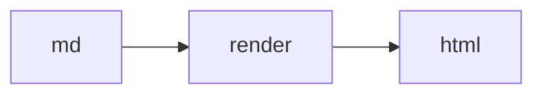

# Sample report

Exercises every renderer feature at once. Bare url https://example.com/x autolinks.
Ticket SCIF-4799 autolinks. MR !1737 autolinks when origin resolves.

## Code highlight

```python
def hello(name: str) -> str:
    return f"hi {name}"
```

Inline `code stays inert: SCIF-200 https://in.code` — no links inside.

## Table + list

| col | meaning |
| --- | ------- |
| a   | first   |
| b   | second  |

1. one
2. two
   - nested

## Diagram



## Blockquote

> archive = md, derived view = html.
