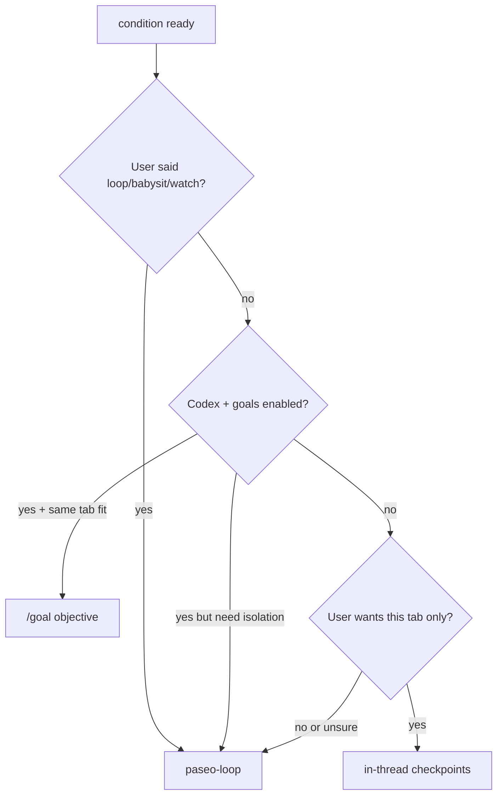

# Paseo Goal Skill

Turn intent into a **verifiable completion condition**, then run until it holds. This skill **does not** add daemon slash commands — it orchestrates existing primitives:

| Primitive                                     | When                                                          |
| --------------------------------------------- | ------------------------------------------------------------- |
| **Codex `/goal`**                             | Codex agent, same thread, native goals enabled                |
| **[paseo-loop](skills/paseo-loop/SKILL.md)**  | Isolated workers, babysit, background, default when unsure    |
| **In-thread checkpoints**                     | Non-Codex, user wants **this tab** continuously               |
| **MCP `set_paseo_goal`**                      | Path C: daemon turn-end continuation for non-Codex in-tab     |
| **MCP `clear_paseo_goal` / `get_paseo_goal`** | Path C: stop or inspect the active in-tab goal                |
| **`--clarify`**                               | Thin intent → goal doc first, **STOP, no code**               |
| **`clear` / `status`**                        | Stop or inspect the active goal for the current orchestration |

**User's arguments:** $ARGUMENTS

## Prerequisites

1. Read the **paseo** skill.
2. For decisions, read **paseo-ask** — never ask in chat prose (`要…吗?`, `let me know`).
3. Before loop runs, read **paseo-loop** and `~/.paseo/orchestration-preferences.json` unless the user named providers.
4. Goal docs live under **`$PASEO_HOME/goals/docs/`** (packaged daemon: `~/.paseo/goals/docs/`).

## Parse `$ARGUMENTS`

| Input                                         | Action                                                                                      |
| --------------------------------------------- | ------------------------------------------------------------------------------------------- |
| Empty                                         | List `$PASEO_HOME/goals/docs/*.md` with status; offer resume via Kickoff or new `--clarify` |
| `clear`, `--clear`, `cancel`, `stop`          | **Clear only** → § Clear (no new work)                                                      |
| `status`, `--status`                          | **Status only** → § Status (read-only)                                                      |
| `--clarify …`                                 | **Clarify only** → § Clarify                                                                |
| Intent looks thin (< measurable end + verify) | Offer `--clarify` or run clarify inline before execute                                      |
| Else                                          | **Execute** → § Orchestration                                                               |

Strip `--clarify` from args when branching to clarify mode. Treat `clear` / `status` as exact first-token matches (case-insensitive); do not treat them as goal conditions.

---

## Clarify (`--clarify`)

**STOP after clarify.** No business code, tests, commits, or implementation agents.

### When to use / skip

**Use:** multi-module work, > ~20 min, requirements will grow, exploratory.

**Skip:** one-line fix, user already gave a strong condition → say so and go to Execute.

### Question ladder

Follow **paseo-ask**: native AskUserQuestion → MCP `ask_question` → inbox `paseo question wait` on timeout. **Never** chat-prose decisions.

Interview: infer repo first; batch ≤4 questions, max 2 rounds (deliverable, in/out scope, verify command, turn budget).

### Strong condition (synthesize one paragraph)

```text
<end state>, verified by <command or artifact>, while preserving <constraints>.
NOT acceptable: <near-miss traps>. Limit to <areas>.
If blocked, stop with exact missing input. Or stop after <N> turns.
```

Repeat the end-state sentence in the Kickoff block (drift guard).

### Goal doc

Write `$PASEO_HOME/goals/docs/<slug>.md` (kebab-case ≤40 chars; collision → `-2` or date).

Frontmatter or header: `status: clarified`, `created`, `source intent`.

Sections: **Objective**, **Deliverable**, **Scope (In/Out)**, **Definitions & edge cases**, **Constraints**, **Subtasks**, **Risks**, **Acceptance criteria**, **Not done (near-miss traps)**, **How to execute**, **Kickoff**, **Changelog**.

Append when execution starts later: `Orchestration chosen`, `Started`, `Ended`, iteration summary.

### Clarify outputs (print all)

1. Doc path
2. One-line summary
3. Fenced kickoff: `/paseo-goal <strong condition>` (and `@$PASEO_HOME/goals/docs/<slug>.md` if complex)
4. **STOP** — do not implement. If user asks to implement, point at kickoff without `--clarify`.

---

## Orchestration (model chooses path)

Before starting, **one timeline line**: which path and why.



### Tie-breaks (P0)

- User already said **loop / babysit / watch / keep trying until** → **paseo-loop** directly (do not re-route).
- **Unsure** → **paseo-loop** (default).
- **Non-Codex**, user did **not** ask for this tab → **paseo-loop**, not in-thread.
- **Codex `/goal` fails, blocked, or budget-limited** → **automatic fallback** to paseo-loop with same condition.

### Path A — Codex `/goal` (turn-internal)

When **all** hold:

- Current agent provider is **Codex** with goals enabled (CLI ≥ 0.128; daemon passes `--enable goals`).
- User wants **same thread / tab**.
- Condition is provable from **transcript evidence** (test output, exit codes in timeline).

Actions:

- `send_agent_prompt` with `/goal <objective>` (objective = strong condition paragraph).
- Control: `/goal pause`, `/goal resume`, `/goal clear` (out-of-band; do not cancel running turn).
- On failure → **fallback paseo-loop** (§ Path B).

Do **not** use this path for Claude/OMP/ACP — they have no native `/goal` in Paseo.

### Path B — paseo-loop (outer loop)

When:

- Default / unsure / isolation / babysit / background / cross-provider verify.
- Codex `/goal` fallback.

Read **paseo-loop** skill. From the condition:

1. **Worker prompt** — what to do this iteration; self-contained.
2. **Verifier** — condition as `--verify` prompt: `{ passed: boolean, reason: string }` citing command/file evidence; and/or `--verify-check` when a shell command proves completion.
3. **`--max-iterations`** / **`--max-time`** — always set.
4. Providers from preferences unless user named them.

Update goal doc: `Orchestration chosen: paseo-loop`, loop id when known.

### Path C — In-thread continuation (non-Codex, this tab only)

When user **explicitly** wants the **current agent tab** and provider is not Codex (or Codex goals unavailable and user insists on tab).

**Primary mechanism (daemon):**

1. After clarify, call MCP **`set_paseo_goal`** with the strong condition paragraph (`maxIterations` optional, default 12).
2. Work normally in this tab — the daemon evaluates after each turn and injects a `<paseo-system>` continuation nudge when not met.
3. On success the daemon clears the active goal automatically; on block or max iterations, stop and report.
4. User cancel → MCP **`clear_paseo_goal`**. Status → MCP **`get_paseo_goal`**.

**Fallback:** if `set_paseo_goal` is unavailable (`paseo-goal is not available on this host`), **fallback to Path B (paseo-loop)** — do not rely on agent self-continuation alone.

**Agent checkpoint contract** (still useful for transparency in the transcript):

```text
GOAL_STATUS: met | blocked | continue
GOAL_REASON: <one evidence-based sentence citing commands/files>
```

- **`met`** → stop; update doc `status: done`; daemon clears goal.
- **`blocked`** → **stop**; list exact user input needed; call **`clear_paseo_goal`**.
- **`continue`** → keep working; daemon handles turn-end nudges when goal is registered.

Producer never grades alone on large changes — the daemon evaluator runs a separate read-only pass when configured providers exist.

---

## Clear (`clear` / `cancel` / `stop`)

**STOP after clear.** Do not start new work, re-register a goal, or run verify loops.

Determine which orchestration is active for **this agent tab**, then clear in order:

1. **Path C (daemon in-tab goal)** — call MCP **`clear_paseo_goal`** for the current agent.
   - On success: print condition cleared, final status, iteration budget used.
   - If none active: say **no active in-tab goal on this tab**.
2. **Path A (Codex native goal)** — when provider is Codex with goals enabled, `send_agent_prompt` with **`/goal clear`** (out-of-band; do not cancel a running turn).
   - If Codex reports no goal: say so explicitly.
3. **Path B (paseo-loop)** — read the linked goal doc for `loop id` / `Orchestration chosen: paseo-loop`.
   - Run **`paseo loop ls`** if needed, then **`paseo loop stop <id>`**.
   - If no loop id is known, list recent loops and **`ask_question`** which to stop (≤4 options).

**Goal doc:** if a doc slug is known, append Changelog `Cancelled by user` and set header/frontmatter `status: cancelled`.

**Output (always):**

1. Which path was cleared (C / A / B) or that nothing was active
2. One-line confirmation
3. If a goal doc was updated, its path

---

## Status (`status`)

**Read-only.** Do not clear, re-register, or start work.

Report active goal state for **this tab** using the same path detection as § Clear:

| Path                  | How to inspect                                                                                                                       |
| --------------------- | ------------------------------------------------------------------------------------------------------------------------------------ |
| **C — daemon in-tab** | MCP **`get_paseo_goal`** → print `condition`, `status`, `iteration` / `maxIterations`, `lastEvaluationReason` when present           |
| **A — Codex native**  | Codex agents: check whether a native goal is set (transcript / `/goal` state if visible). If none, say **no Codex goal on this tab** |
| **B — paseo-loop**    | Goal doc loop id → **`paseo loop inspect <id>`**; else **`paseo loop ls`** and surface the most likely match                         |

Also show the latest **`$PASEO_HOME/goals/docs/`** entry for this work when a doc slug is known (status, objective first line, last changelog entry).

If nothing is active on any path, say so and offer **`/paseo-goal`** (empty) to pick a doc to resume or **`/paseo-goal --clarify`** for a new goal.

---

## Empty `$ARGUMENTS`

1. `ls` / read `$PASEO_HOME/goals/docs/`.
2. Show each doc: slug, status, objective first line, last changelog entry.
3. **`ask_question`**: resume which doc, new `--clarify`, or cancel (≤4 options).

---

## Compared to neighbors

| User says                    | Use                                                     |
| ---------------------------- | ------------------------------------------------------- |
| Goal / 一直做到 X / clarify  | **This skill**                                          |
| `--clarify` only             | **This skill § Clarify**                                |
| Cancel / stop / clear goal   | **This skill § Clear** (`/paseo-goal clear`)            |
| Goal status / what's running | **This skill § Status** (`/paseo-goal status`)          |
| Obvious loop/babysit/watch   | **paseo-loop** (or this skill routes there)             |
| Codex native engine only     | **`/goal`** on Codex agent (this skill may route there) |
| Every N minutes reminder     | **heartbeat**                                           |
| Cron fresh agent             | **schedule**                                            |

---

## Safety

- No destructive verify unless user asked.
- No secrets in goal docs.
- Clarify phase: **no code**.
- Open-ended goals need turn/time bounds in the condition or loop flags.

## Code-task add-on (append to worker / in-thread)

```text
Read the existing codebase first and follow local patterns.
Do not make unrelated refactors.
Verify with the most relevant tests or checks before claiming met.
```
